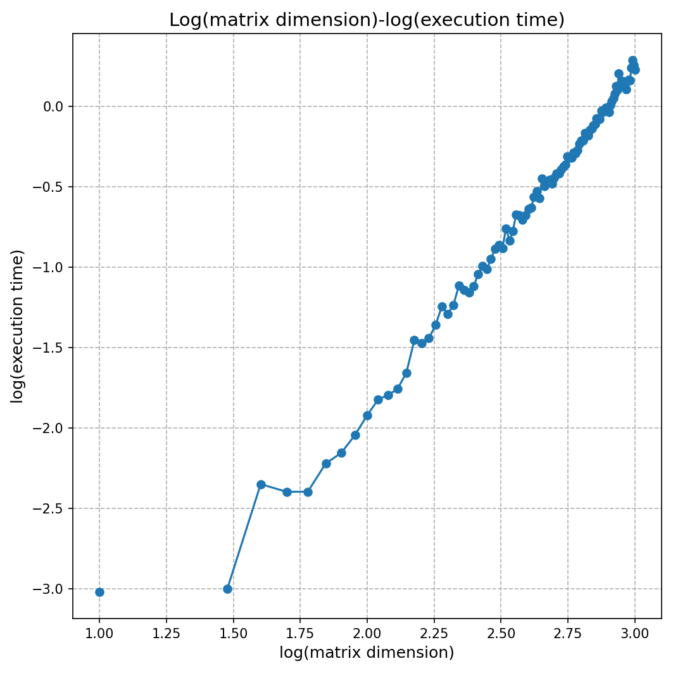

<font size = 4>
<center>

**homework_20240903**
</center>

<br>

**1.** Let \(\hat{x}\) be an approximation to \(x\). In practice it is often much easier to estimate \(\tilde{E}_{\text{rel}} = {|x - \hat{x}|}/{|\hat{x}|}\) compared to \({E}_{\text{rel}} = {|x - \hat{x}|}/{|x|}\). What is the relationship between \(E_{\text{rel}}\) and \(\tilde{E}_{\text{rel}}\)?

真实相对误差
\[
E_{\text{rel}}(\hat{x}) = \frac{|x - \hat{x}|}{|x|} = \frac{|x - \hat{x}|}{|\hat{x} + (x - \hat{x})|},
\]

根据 \(|x| \approx |\hat{x}|\), 可以知道 \( |x - \hat{x}| \) 很小,

因此作估计
\[
E_{\text{rel}}(\hat{x}) \approx \frac{|x - \hat{x}|}{|\hat{x}| + |x - \hat{x}|}, 
\]

进而获得 \(E_{\text{rel}}\) 和 \(\tilde{E}_{\text{rel}}\) 间的近似关系
\[
E_{\text{rel}}(\hat{x}) \approx \frac{|x - \hat{x}|}{|\hat{x}|} \cdot \frac{1}{1 + \frac{|x - \hat{x}|}{|\hat{x}|}} = \frac{\tilde{E}_{\text{rel}}(\hat{x})}{1 + \tilde{E}_{\text{rel}}(\hat{x})}.
\]

由此可以知道 \(E_{\text{rel}} < \tilde{E}_{\text{rel}}\).

在计算中，由于不知道 \(x\) 的值，通常使用 \(\tilde{E}_{\text{rel}} = {|x - \hat{x}|}/{|\hat{x}|} \), 但是 \(\tilde{E}_{\text{rel}}\) 中依然含 \(x\), 实际上可能会使用连续近似法：

(1). 设 \( \hat{x}_{k} \) 是第 \(k\) 步的近似值.
(2). 设 \( \hat{x}_{k+1} \) 是下一步第 \((k+1)\) 步的近似值.

然后可以计算近似相对误差为：

\[
\tilde{E}_{\text{rel}}(\hat{x}_{k+1}) = \frac{|\hat{x}_{k+1} - \hat{x}_k|}{|\hat{x}_{k+1}|}.
\]

如果算法收敛，\( \tilde{E}_{\text{rel}} \) 应该随着 \( k \) 的增加而变小. 当 \( \tilde{E}_{\text{rel}} \) 低于某个阈值时，算法停止，表明连续近似值已足够接近，因而能足够接近真实值 \( x \).


一个例子是考虑用牛顿迭代法求方程的近似数值解，迭代公式为：

\[
\hat{x}_{k+1} = \hat{x}_k - \frac{f(\hat{x}_k)}{f'(\hat{x}_k)}
\]

这里真实的根 \( x \) 是未知的. 如果 \(\tilde{E}_{\text{rel}}(\hat{x}_{k+1})\) 小于某个阈值，则可以认为 \( \hat{x}_{k+1} \) 足够接近真实的根 \( x \).

<br>

**2.** How to estimate \(f(x) = \tan x - \sin x\) for \(x \approx 0\) so that numerical cancellation is avoided?

可以考虑使用泰勒级数展开

\[
\tan x = x + \frac{x^3}{3} + \frac{2x^5}{15} + o(x^6) 
\]

\[
\sin x = x - \frac{x^3}{6} + \frac{x^5}{120} + o(x^6) 
\]

\[
\begin{align}
f(x) = \tan x - \sin x &= \frac{x^3}{2} + \frac{x^5}{8} + o(x^6) \notag \\ &= \frac{x^3}{2} + o(x^4) \notag
\end{align}
\]

<center>

as \(x \approx 0 \)
</center>

于是可有如下估计，估计式精度可根据需要调整
\[
f(x) \approx \frac{x^3}{2} + \frac{x^5}{8} 
\]

<br>

**3.** Let \(A\) be a square banded matrix with half-bandwidth \(\beta\) (i.e., \(a_{ij} = 0\) if \(|i - j| > \beta\)). Suppose that the \(LU\) factorization of \(A\) (without pivoting) is \(A = LU\). Show that both \(L\) and \(U\) are banded matrices with half-bandwidth \(\beta\).

设下三角矩阵 \(L\) 为
\[L = 
\begin{bmatrix}
l_{11} & 0 & 0 & \ldots & 0 \\
l_{21} & l_{22} & 0 & \ldots & 0 \\
l_{31} & l_{32} & l_{33} & \ldots & 0 \\
\vdots & \vdots & \vdots & \ddots &  \vdots \\
l_{n1} & l_{n2} & l_{n2} & \ldots & l_{nn} \\
\end{bmatrix}
\]

其中 \(l_{ii} = 1, \quad i = 1, 2, \cdots, n\)

设上三角矩阵 \(U\) 为
\[U = 
\begin{bmatrix}
u_{11} & u_{12} & u_{13} & \ldots & u_{1n} \\
0 & u_{22} & u_{23} & \ldots & u_{2n} \\
0 & 0 & u_{33} & \ldots & u_{3n} \\
\vdots & \vdots & \vdots & \ddots &  \vdots \\
0 & 0 & 0 & \ldots & u_{nn} \\
\end{bmatrix}
\]

带状矩阵 \(A\) 可以这样描述 \[a_{ij} = 0, \ when
\begin{cases} 
i < j - \beta & \text{对应右上角} \\
i > j + \beta & \text{对应左下角}
\end{cases}
\]

先考虑矩阵 \(L\) 作为行变换矩阵左作用于矩阵 \(U\), 并考察作变换后新矩阵 \(U_1, U_2, \cdots, U_n\) 的右上角区域, \(U_k\) 表示 \(U\) 的前 \(k\) 行元素被改变后的结果. 

\(L\) 第一行的非零元素 \(l_{11}=1\) 表示使 \(U\) 的第一行的全部元素变为原来的 \(l_{11}=1\) 倍, 而由于 \(L\) 是下三角矩阵，因此 \(L\) 第一行之后的所有行的元素不会再对矩阵 \(U\) 的第一行产生影响. 如此获得 \(U_1\). 

之后比对 \(U_1\) 的第一行和 \(A\) 的第一行, 由于\(A\) 的第一行中满足 \(i < j - \beta\) 条件的元素为零，可以得到 \(U\) 的第一行中满足 \(i < j - \beta\) 条件的元素也为零，亦即 \(u_{1(2+\beta)}, \cdots ,u_{1n}\) 为零.

\(L\) 第二行的非零元素是 \(l_{21}\) 和 \(l_{22}=1\). 其中 \(l_{22}\) 的作用与 \(l_{11}=1\) 类似, 其作用是使 \(U_1\) 的第二行的全部元素变为原来的 \(l_{22}=1\) 倍. 而 \(l_{21}\) 表示将 \(U_1\) 的第一行的 \(l_{21}\) 倍加到 \(U_1\) 的第二行上, 其中加到第二行 \(u_{2(3+\beta)}, \cdots ,u_{2n}\) 的 \(l_{21}u_{1(3+\beta)}, \cdots ,l_{21}u_{1n}\) 都是零, 这相当于对于 \(U_1\) 的第二行中满足 \(i < j - \beta\) 条件的元素只受到 \(l_{22}=1\) 的作用. 而由于 \(L\) 是下三角矩阵，因此 \(L\) 第二行之后的所有行的元素不会再对矩阵 \(U_1\) 的第二行产生影响. 如此获得 \(U_2\).

之后比对 \(U_2\) 的第二行和 \(A\) 的第二行的元素, 可以得到 \(U_2\) 的第二行中满足 \(i < j - \beta\) 条件的元素也为零，亦即 \(u_{2(3+\beta)}, \cdots ,u_{2n}\) 为零.

按以上方法依次比对经 \(L\) 作用后的 \(U_k\) 和带状矩阵 \(A\) 的第\(k\)行, 直到 \(k = n\). 可以发现 \(U\) 各行中满足 \(i < j - \beta\) 条件的元素都为零, 而 \(U\) 本来就是上三角矩阵, 自然成立：满足 \(i > j + \beta\) 条件的元素都是零. 因而 \(U\) 也是带状矩阵, 且半带宽也是 \(\beta\) .

考虑对 \(A = LU\) 两边进行转置：\(A^T = U^TL^T\),

不难发现 \(A^T\) 也是带状矩阵, \(U^T\)是下三角矩阵, \(L^T\)是上三角矩阵. 按分析 \(A = LU\) 中 \(U\) 为带状矩阵的方法同理可获得：\(L^T\) 为带状矩阵, 因而 \(L\) 为带状矩阵, 考虑到转置不改变带宽, \(L\) 的半带宽也是 \(\beta\).


<br>

**4.** Find the exact \(LU\) factorization of the \(n \times n\) matrix

\[
\begin{bmatrix}
1 & 0 & 0 & \ldots & 0 & 1 \\
-1 & 1 & 0 & \ldots & 0 & 1 \\
-1 & -1 & 1 & \ldots & 0 & 1 \\
\vdots & \vdots & \vdots & \ddots & \vdots & \vdots \\
-1 & -1 & -1 & \ldots & 1 & 1 \\
-1 & -1 & -1 & \ldots & -1 & 1 \\
\end{bmatrix}
\]

考虑对该矩阵进行高斯消元法
\[
\begin{bmatrix}
1 & 0 & 0 & \ldots & 0 & 1 \\
-1 & 1 & 0 & \ldots & 0 & 1 \\
-1 & -1 & 1 & \ldots & 0 & 1 \\
\vdots & \vdots & \vdots & \ddots & \vdots & \vdots \\
-1 & -1 & -1 & \ldots & 1 & 1 \\
-1 & -1 & -1 & \ldots & -1 & 1 \\
\end{bmatrix}
\]
\[
\rightarrow 
\begin{bmatrix}
1 & 0 & 0 & \ldots & 0 & 1 \\
0 & 1 & 0 & \ldots & 0 & 2 \\
0 & -1 & 1 & \ldots & 0 & 2 \\
\vdots & \vdots & \vdots & \ddots & \vdots & \vdots \\
0 & -1 & -1 & \ldots & 1 & 2 \\
0 & -1 & -1 & \ldots & -1 & 2 \\
\end{bmatrix} \quad
\]
\[
\rightarrow
\begin{bmatrix}
1 & 0 & 0 & \ldots & 0 & 1 \\
0 & 1 & 0 & \ldots & 0 & 2 \\
0 & 0 & 1 & \ldots & 0 & 4 \\
\vdots & \vdots & \vdots & \ddots & \vdots & \vdots \\
0 & 0 & -1 & \ldots & 1 & 4 \\
0 & 0 & -1 & \ldots & -1 & 4 \\
\end{bmatrix} \quad
\]
\[
\rightarrow \ldots \rightarrow 
\begin{bmatrix}
1 & 0 & 0 & \ldots & 0 & 1 \\
0 & 1 & 0 & \ldots & 0 & 2 \\
0 & 0 & 1 & \ldots & 0 & 4 \\
\vdots & \vdots & \vdots & \ddots & \vdots & \vdots \\
0 & 0 & 0 & \ldots & 1 & 2^{n-2} \\
0 & 0 & 0 & \ldots & 0 & 2^{n-1} \\
\end{bmatrix} \quad \quad \quad \quad
\]

将行变换的结果记为, \(U = \begin{bmatrix}
1 & 0 & 0 & \ldots & 0 & 1 \\
0 & 1 & 0 & \ldots & 0 & 2 \\
0 & 0 & 1 & \ldots & 0 & 4 \\
\vdots & \vdots & \vdots & \ddots & \vdots & \vdots \\
0 & 0 & 0 & \ldots & 1 & 2^{n-2} \\
0 & 0 & 0 & \ldots & 0 & 2^{n-1} \\
\end{bmatrix} \).

将各个行变换用矩阵 \(\hat{L}\) 表示, \(\hat{L}=\begin{bmatrix}
1 & 0 & 0 & \ldots & 0 & 0 \\
1 & 1 & 0 & \ldots & 0 & 0 \\
1 & 1 & 1 & \ldots & 0 & 0 \\
\vdots & \vdots & \vdots & \ddots & \vdots & \vdots \\
1 & 1 & 1 & \ldots & 1 & 0 \\
1 & 1 & 1 & \ldots & 1 & 1 \\
\end{bmatrix} \).


于是有 \(\hat{L}A = U\).

记 \(\hat{L}\) 的逆矩阵为 \(L\) , \(L = \hat{L}^{-1} = \begin{bmatrix}
1 & 0 & 0 & \ldots & 0 & 0 \\
-1 & 1 & 0 & \ldots & 0 & 0 \\
-1 & -1 & 1 & \ldots & 0 & 0 \\
\vdots & \vdots & \vdots & \ddots & \vdots & \vdots \\
-1 & -1 & -1 & \ldots & 1 & 0 \\
-1 & -1 & -1 & \ldots & -1 & 1 \\
\end{bmatrix} \).

如此有 \(A = LU\). 

**5.** Implement Gaussian elimination (without pivoting) for solving non-singular linearsystems. You may assume that no divide-by-zero error is encountered. Measure the execution time of your program in terms of matrix dimensions and visualize the result by a log–log scale plot. (You may generate your test matrixes with normally distributed random elements.)

假设系数矩阵是 \(n \times n \) 的方阵, 亦即解向量是 \(n\) 维的.

将加减乘除同权重地看作一次运算，则通过高斯消元法（不进行主元选取）变换系数矩阵需要的运算次数是：
\[
\begin{align}
\sum\limits_{k=1}^{n-1}((n-k)+2(n-k)^2) &= \frac{n(n-1)}{2} + \frac{(n-1)n(2n-1)}{3} \notag \\ &= \frac{2n^3}{3} + O(n^2) \notag
\end{align}
\]

获得解向量所需要的运算次数是：
\[
\begin{align}
1 + \sum\limits_{k=1}^{n-1}(2k + 1) &= 1 + n(n-1) + (n-1) = O(n^2) \notag 
\end{align}
\]

理论上最多运算次数：
\[
\frac{2n^3}{3} + O(n^2)
\]

```python
import numpy as np
import time
import matplotlib.pyplot as plt

def gaussian_elimination(A, b):
    n = len(b)
    Ab = np.hstack([A, b.reshape(-1, 1)])
```
```python    
    for i in range(n):
        for j in range(i+1, n):
            factor = Ab[j, i] / Ab[i, i]
            Ab[j, i:] -= factor * Ab[i, i:]

    x = np.zeros(n)
    for i in range(n-1, -1, -1):
        x[i] = (Ab[i, -1] - np.dot(Ab[i, i+1:n], x[i+1:n])) / Ab[i, i]
    
    return x
```
```python
def generate_test_matrix(n):
    A = np.random.randn(n, n)  
    b = np.random.randn(n)     
    return A, b
```
```python
def measure_execution_time(n):
    A, b = generate_test_matrix(n)
    start_time = time.time()  
    gaussian_elimination(A, b) 
    end_time = time.time()     
    return end_time - start_time  
```
```python
if __name__ == "__main__":
    dimensions = np.arange(10, 1001, 10)
    times = []

    for n in dimensions:
        exec_time = measure_execution_time(n)
        times.append(exec_time)
    log_dimensions = np.log10(dimensions)
    log_times = np.log10(times)

    plt.figure(figsize=(8, 6))
    plt.plot(log_dimensions, log_times, marker='o', linestyle='-')
    plt.xlabel('log(matrix dimension)', fontsize=12)
    plt.ylabel('log(execution time)', fontsize=12)
    plt.title('Log(matrix dimension)-log(execution time)', fontsize=14)
    plt.grid(True, which="both", ls="--")
    plt.show()
```

<center>

</center>

估计当矩阵的维度足够大时，拟合的直线斜率大约是 \(2\frac{2}{3}\)，小于理论最大斜率 \(3\) .

<br>

**6.** (optional) Write a program to solve the quadratic equation \(ax^2 + bx + c = 0\) with real coefficients. Describe how to avoid cancellation when the equation has a tiny root.

当 \(|b| \gg |ac|\) 时, 求根公式的某个分子 \(-|b|+\sqrt{(b^2 - 4ac)}\) 会发生相消现象. 按照二次方程的韦达定理, 我们有：
\[
\begin{cases}
x_1 + x_2 &= -b/a \\
\ \ ~ x_1x_2 &= c/a 
\end{cases}
\]

不妨设 \(b > 0\), 可以先计算出方程的一个根 \(x_1 = \frac{-b-\sqrt{(b^2 - 4ac)}}{2a}\), 此时分子不会相消, 再利用韦达定理，可以获得另一个根 \(x_2 = \frac{2c}{-b-\sqrt{(b^2 - 4ac)}}\), 以下是上述描述的实现：

```python
from math import sqrt

def determinant(a, b, c):
    delta = b**2 - 4*a*c
    return delta
```
```python
def is_root_real(a, b, c):
    delta = determinant(a, b, c)
    if delta >= 0:
        return True
    else:
        return False
```
```python
def quad_fun_solve(a, b, c):
    if is_root_real(a, b, c):
        delta = determinant(a, b, c)       
        # 判断是否会发生消元误差
        if abs(delta - abs(b)) < 1e-2:
            if b > 0:
                x1 = (-b - sqrt(delta)) / (2*a)
                x2 = 2*c / (-b - sqrt(delta))
            else:
                x1 = (-b + sqrt(delta)) / (2*a)
                x2 = 2*c / (-b + sqrt(delta))
        else:
            x1 = (-b + sqrt(delta)) / (2*a)
            x2 = (-b - sqrt(delta)) / (2*a)
        return x1, x2
    else:
        return None
```
```python
if __name__ == "__main__":
    a, b, c = map(float, input("请输入方程系数 a b c，例如 1 2 3 ").split())
```
```python
    result = quad_fun_solve(a, b, c)
    if result:
        x1, x2 = result
        print(f"x1 = {x1}, x2 = {x2}")
    else:
        print("无实数根。")

```


**7.** (optional) Suppose that you are evaluating the harmonic series using IEEE double precision floating-point numbers and obtained a “converged” result. Make an estimate on when the computation converges, and what is the final result.

假设调和级数的和IEEE 75464位双精度浮点数进行表示时二进制指数转换成的十进制指数是5，亦即先假设调和级数的和大概在32到64之间.

而双精度浮点数不计入首位的有效位数为52位二进制数**，也就是说能精确表示的最小差异大约是 \( 2^{-52} \)，即约为 \( 2.22 \times 10^{-16} \)，结合假设的指数位置为 5，最小差异应该约为 \( 7.11 \times 10^{-15} \).

当 \( \frac{1}{n} \) 小于这个精度时，不再影响最终的结果，即当 \( \frac{1}{n} < 7.11 \times 10^{-15} \) 时，调和级数看上去就收敛了.

\[
n > \frac{1}{7.11 \times 10^{-15}} \approx 1.41 \times 10^{14}
\]

检验此时的调和级数，有调和级数的估计：
\[
1 + \frac{1}{2} + \ldots + \frac{1}{n} = ln(n) + c \quad \quad
c \approx 0.57721 \ldots
\]

估算调和级数大概是 \( ln(1.41 \times 10^{14}) + c \approx 33.15512748631743 \) ，符合假设.

因此，当 \( n \) 达到约 \(1.41 \times 10^{14}\) 时，调和级数收敛至 \(33.16\).

<font>