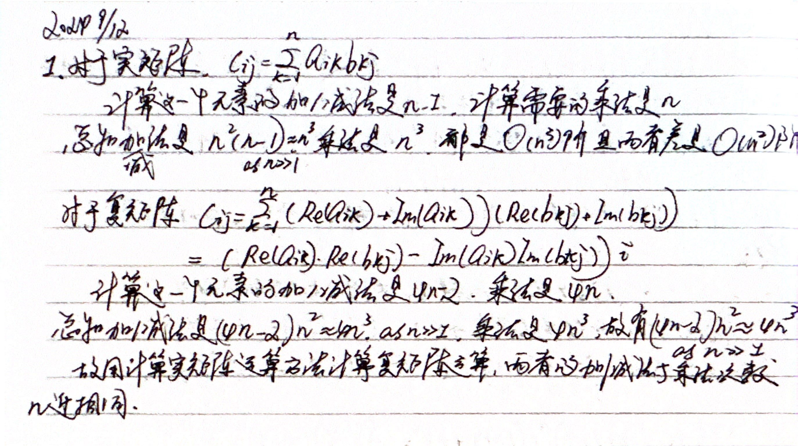
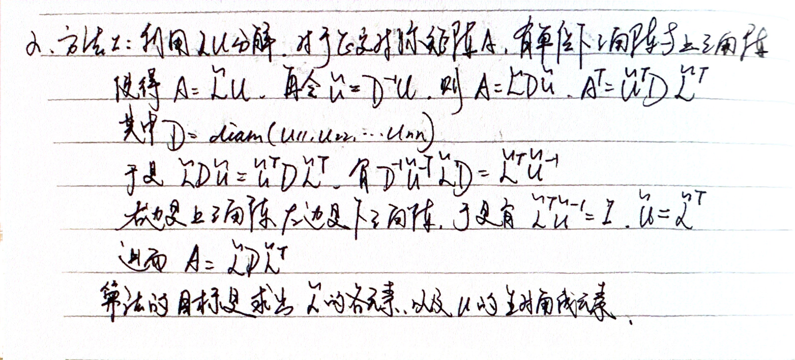
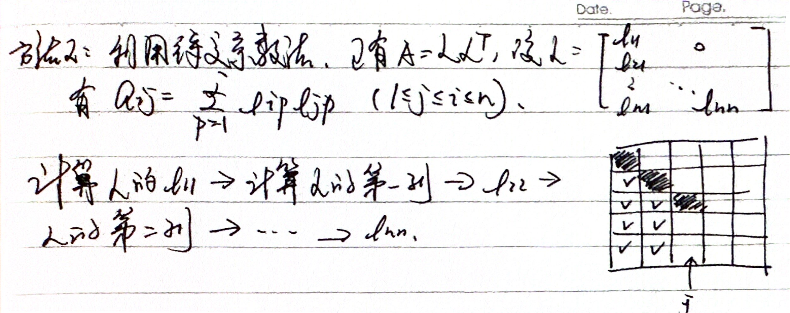
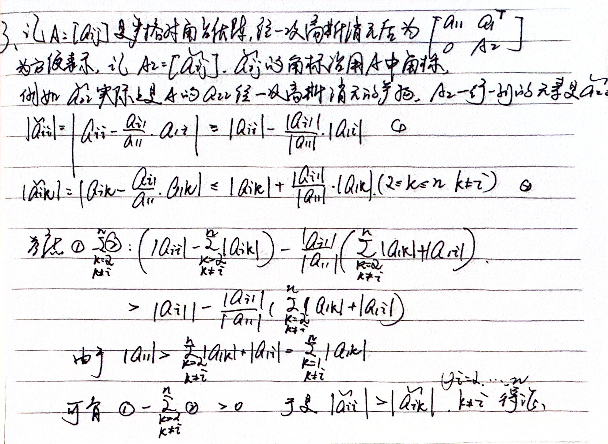
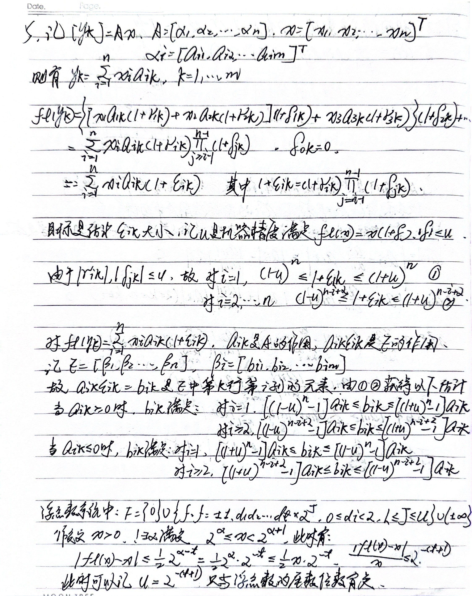

<center>

**homework_20240910**
</center>

#### 第一题

  

#### 第二题

##### 方法一
 
  
##### 方法二

  
##### 文件 T2.py
```python
import numpy as np
from math import sqrt

# Method One: get Cholesky factorization through LU factorization
def cholesky_1(A):
    n = A.shape[0]
    for i in range(n):
        for j in range(i+1, n):
            factor = A[j, i] / A[i, i]
            A[j, i] = factor
            A[j, i+1:] = A[j, i+1:] - factor * A[i, i+1:]        
    diag_elements = np.diag(A)
    diag_matrix = np.diag(np.sqrt(diag_elements))

    L_tilde = np.tril(A, k = -1)
    np.fill_diagonal(L_tilde, 1)
    L = np.dot(L_tilde, diag_matrix)
    return L
```
```python
# Method Two: get Cholesky factorization through undetermined coefficient
def cholesky_2(A):
    n = A.shape[0]
    for i in range(n):
        A[i, i] = sqrt(A[i, i])
        A[i+1:, i] = A[i+1:, i] / A[i, i]
        for j in range(i+1 , n):
            A[j:, j] = A[j:, j] - A[j, i] * A[j:, i]
    L = np.tril(A)
    return L        

def check_factorization(A, fac_fun):
    L = fac_fun(A)
    A_result = np.dot(L, L.T)
    print(f"{fac_fun.__name__} gets \n{A_result}")
    return A_result
```
```python
# test
A = np.array([[1,2,3],
              [2,7,6],
              [3,6,10]], dtype = np.float64)

A_copy = np.copy(A)

check_factorization(A, cholesky_1)
check_factorization(A_copy, cholesky_2)
```


#### 第三题



#### 第四题
##### 文件 T4.py
```python
import numpy as np
import time
import matplotlib.pyplot as plt


def partial_pivoting_gaussion_elimination(A):
    copy_A = np.copy(A)
    n = copy_A.shape[0]

    for i in range(n):
        max_row_i =  np.argmax(np.abs(A[i:, i])) + i
        if max_row_i != i:
            A[[i, max_row_i], :] = A[[max_row_i, i], :]

        for j in range(i+1, n):
            factor = A[j, i] / A[i, i]
            A[j, i:] = A[j, i:] - factor * A[i, i]
    
    return copy_A


def complete_pivoting_gaussion_elimination(A):
    copy_A = np.copy(A)
    n = copy_A.shape[0]

    for i in range(n):

        max_row_i = np.argmax(np.abs(A[i:, i])) + i
        if max_row_i != i:
            A[[i, max_row_i], :] = A[[max_row_i, i], :]

        max_col_i = np.argmax(np.abs(A[i, i:])) + i
        if max_col_i != i:
            A[:, [max_col_i, i]] = A[:, [i, max_col_i]]

        for j in range(i+1, n):
            factor = A[j, i] / A[i, i]
            A[j, i:] = A[j, i:] - factor * A[i, i:]
    
    return copy_A


def generate_test_matrix(n):
    A = np.random.randn(n,n)
    return A


def measure_execution_time(n, strategy):
    A = generate_test_matrix(n)
    start_time = time.time()
    strategy(A)
    end_time = time.time()
    return end_time - start_time
    

def plot_log_log(strategy):
    dimention = np.arange(1000, 2001, 10)
    times = []

    for n in dimention:
        exec_time = measure_execution_time(n, strategy)
        times.append(exec_time)

    log_dimentions = np.log10(dimention)
    log_times = np.log10(times)

    plt.figure(figsize=(8, 6))
    plt.plot(log_dimentions, log_times, marker='o', linestyle='-')
    plt.xlabel('log(matrix dimension)', fontsize=12)
    plt.ylabel('log(execution time)', fontsize=12)
    plt.title(f'Log(matrix dimension)-log(execution time) for {strategy.__name__}')
    plt.grid(True, which='both', ls='--')
    plt.show(block=False)


plot_log_log(partial_pivoting_gaussion_elimination)
plot_log_log(complete_pivoting_gaussion_elimination)
plt.show()
```

##### 绘图结果
<center>

**部分主元高斯消元**


</center>
<center>

**全主元高斯消元**


</center>

#### 第五题

