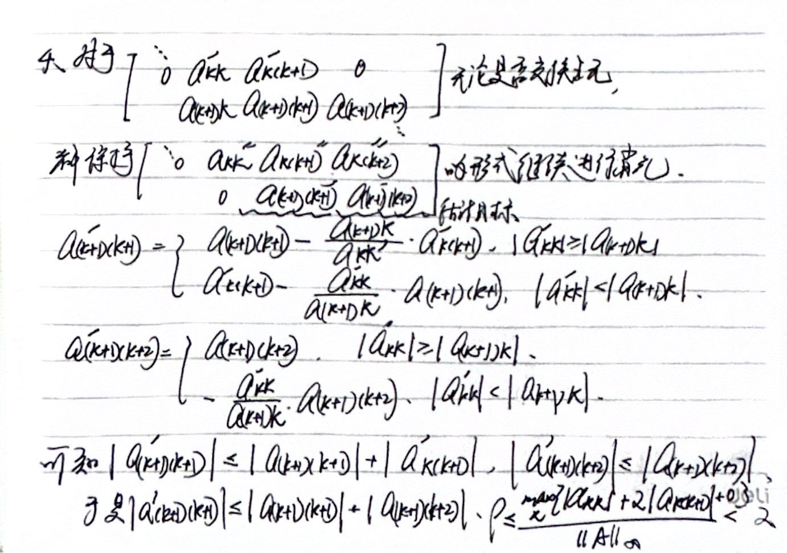

<center>

homework_20240924

</center>

#### 第一题


#### 第二题


#### 第三题


#### 第四题




#### 第五题

程序 T5.py 的运行结果保存在 T5_result.txt 中

两个系数矩阵都是满秩的，因此方程有唯一非零解，可以知道精确解是皆为 1 

结果显示，对第一个线性方程组（主对角线为8，两条副对角线为1和6）分别用全选主元、部分选主元和不选主元得出的解相同，且相对精确解的误差较小；对第二个线性方程组（主对角线为6，两条副对角线为1和8），虽然分别用全选主元、部分选主元和不选主元得出的解相同，但是相对精确解的误差极大

可能是因为第二个系数矩阵的条件数过大，这个问题本身是病态的，因此无论如何选用或者不选用高斯消元法都不能得到相对于精确解误差不大的解


文件 T5.py

```python

import numpy as np

def pivoting_gaussian_elimination(A_origin, b_origin):
    A = np.copy(A_origin)
    b = np.copy(b_origin)
    n = len(b)
    Ab = np.hstack([A, b.reshape(-1, 1)])
    
    for i in range(n):
        max_row = np.argmax(np.abs(A[i:, i])) + i
        if max_row != i:
            A[[i, max_row], :] = A[[max_row, i], :]
        max_col = np.argmax(np.abs(A[i, i:])) + i
        if max_col != i:
            A[:, [i, max_col]] = A[:, [max_col, i]]
        for j in range(i+1, n):
            factor = Ab[j, i] / Ab[i, i]
            Ab[j, i:] -= factor * Ab[i, i:]

    x = np.zeros(n)
    for i in range(n-1, -1, -1):
        x[i] = (Ab[i, -1] - np.dot(Ab[i, i+1:n], x[i+1:n])) / Ab[i, i]
    
    return x


def partial_pivoting_gaussian_elimination(A_origin, b_origin):
    A = np.copy(A_origin)
    b = np.copy(b_origin)
    n = len(b)
    Ab = np.hstack([A, b.reshape(-1, 1)])
    
    for i in range(n):
        max_row = np.argmax(np.abs(A[i:, i])) + i
        if max_row != i:
            A[[i, max_row], :] = A[[max_row, i], :]

        for j in range(i+1, n):
            factor = Ab[j, i] / Ab[i, i]
            Ab[j, i:] -= factor * Ab[i, i:]

    x = np.zeros(n)
    for i in range(n-1, -1, -1):
        x[i] = (Ab[i, -1] - np.dot(Ab[i, i+1:n], x[i+1:n])) / Ab[i, i]
    
    return x


def gaussian_elimination(A_origin, b_origin):
    A = np.copy(A_origin)
    b = np.copy(b_origin)
    n = len(b)
    Ab = np.hstack([A, b.reshape(-1, 1)])
    
    for i in range(n):
        for j in range(i+1, n):
            factor = Ab[j, i] / Ab[i, i]
            Ab[j, i:] -= factor * Ab[i, i:]

    x = np.zeros(n)
    for i in range(n-1, -1, -1):
        x[i] = (Ab[i, -1] - np.dot(Ab[i, i+1:n], x[i+1:n])) / Ab[i, i]
    
    return x

n = 100

# matric one

A1 = np.zeros((n, n), dtype=np.float32)
for i in range(n-1):
    A1[i, i] = 8
    A1[i, i+1] = 1
    A1[i+1, i] = 6

A1[n-1, n-1] = 8

b1 = np.zeros(n, dtype=np.float32)
for i in range(n):
    b1[i] = 15
b1[0] -= 6
b1[n-1] -= 1

without_sol1 = gaussian_elimination(A1, b1)

with_sol1 = pivoting_gaussian_elimination(A1, b1)

with_partial_sol1 = partial_pivoting_gaussian_elimination(A1, b1)


# matric two

A2 = np.zeros((n, n), dtype=np.float32)
for i in range(n-1):
    A2[i, i] = 6
    A2[i, i+1] = 1
    A2[i+1, i] = 8

A2[n-1, n-1] = 6

b2 = np.zeros(n, dtype=np.float32)
for i in range(n):
    b2[i] = 15
b2[0] -= 8
b2[n-1] -= 1

without_sol2 = gaussian_elimination(A2, b2)

with_sol2 = pivoting_gaussian_elimination(A2, b2)

with_partial_sol2 = partial_pivoting_gaussian_elimination(A2, b2)

# print

print(with_sol1)
print(with_partial_sol1)
print(without_sol1)

print(with_sol2)
print(with_partial_sol2)
print(without_sol2)

```
